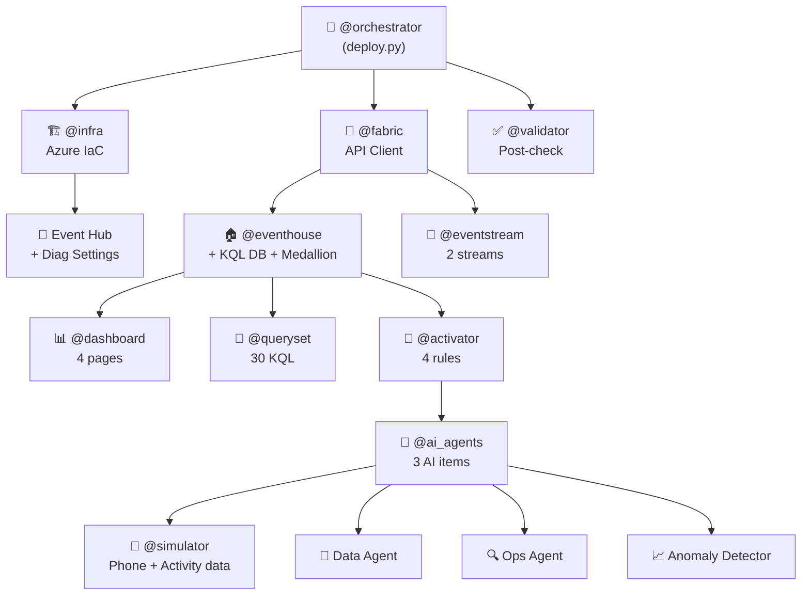

<h1 align="center">
  🤖 RTI Demo — Multi-Agent Architecture
</h1>

<p align="center">
  <b>12 specialized agents orchestrating the full deployment of a Real-Time Intelligence demo</b>
</p>

<p align="center">
  
  
  
  
  
</p>

---

## 🎯 Overview

This project uses a **12-agent specialization model** to automate the full deployment of a Real-Time Intelligence demo into a Fabric workspace. Each agent is responsible for a specific domain and can be invoked independently or orchestrated as a pipeline.

Inspired by the [GitHub Audit Log Analytics](https://github.com/chakras/github-audit-log-analytics) pattern, this project also implements a **medallion architecture** (bronze → silver → gold) using KQL update policies and materialized views.

---

## 🏗️ Architecture



<details>
<summary><b>📐 ASCII Architecture Diagram</b> (click to expand)</summary>

```
                        ┌─────────────────┐
                        │  🎯 @orchestrator│
                        │  (deploy.py)    │
                        └───────┬─────────┘
                                │
          ┌─────────────────────┼─────────────────────┐
          │                     │                     │
    ┌─────▼─────┐        ┌─────▼─────┐        ┌─────▼─────┐
    │ 🏗️ @infra │        │ 🔄 @fabric│        │ ✅ @valid │
    │ Azure IaC │        │ API Client│        │ Post-check│
    └─────┬─────┘        └─────┬─────┘        └───────────┘
          │                    │
          │         ┌──────────┼──────────────┐
          │         │          │              │
    ┌─────▼─────┐ ┌─▼────────┐│ ┌────────────▼──┐
    │ 📡 Event  │ │🏠 @event ││ │ 🔄 @event     │
    │ Hub + Diag│ │ house    ││ │  stream       │
    └───────────┘ │ + Medals ││ └───────────────┘
                  └───────────┘│
                               │
                    ┌──────────┼──────────┐
                    │          │          │
              ┌─────▼────┐ ┌──▼───────┐ ┌▼──────────┐
              │📊 @dash  │ │📝 @query │ │🚨 @activ  │
              │ 4 pages  │ │ 30 KQL   │ │ 4 rules   │
              └──────────┘ └──────────┘ └───────────┘
                                              │
                                        ┌─────▼─────┐
                                        │📱 @simul  │
                                        │ Phone data│
                                        └───────────┘

Post-deployment (manual):
  ┌──────────────┐    ┌───────────────────┐
  │ � Medallion │    │ 🔧 Configure AI   │
  │ (run .kql)   │    │ agents in Fabric UI│
  └──────────────┘    └───────────────────┘
```

</details>

---

## 🤖 Agent Definitions

### 🎯 @orchestrator

| | |
|---|---|
| **Entry point** | `deploy.py` |
| **Role** | Coordinates the full deployment pipeline |

Reads `config.json`, authenticates, resolves workspace, and invokes agents in dependency order.

**Pipeline order**:
1. 🏗️ `@infra` → Azure Event Hub + Diagnostic Settings
2. 🏠 `@eventhouse` → Eventhouse + KQL Database + schema
3. 🔄 `@eventstream` → 3 Eventstreams (Activity + Phone + AWS)
4. 📝 `@queryset` → KQL Queryset with demo queries
5. 📊 `@dashboard` → Real-Time Dashboard with 4 pages
6. 🚨 `@activator` → 4 Activator alert rules
7. 🤖 `@ai_agents` → Data Agent + Ops Agent + Anomaly Detector
8. ✅ `@validator` → Post-deployment health check
9. 📱 `@simulator` → Start phone/activity/AWS/Teams telemetry (optional)

---

### 🏗️ @infra

| | |
|---|---|
| **Module** | `agents/infra_agent.py` |
| **Role** | Provisions Azure resources using Azure CLI |

- Creates Resource Group
- Creates Event Hub Namespace + 2 Event Hubs
- Configures Azure Subscription Diagnostic Settings → Event Hub
- Returns Event Hub connection strings

---

### 🏠 @eventhouse

| | |
|---|---|
| **Module** | `agents/eventhouse_agent.py` |
| **Role** | Creates the Eventhouse and KQL Database via Fabric REST API |

- `POST /v1/workspaces/{id}/eventhouses` → creates Eventhouse
- `POST /v1/workspaces/{id}/kqlDatabases` → creates KQL DB with schema
- Schema: 9 bronze tables across 4 domains:
  - **Azure**: `AzureActivity`
  - **Phone**: `PhoneTelemetry`
  - **AWS**: `AWSCloudTrail`, `AWSVPCFlowLogs`, `AWSCloudWatchMetrics`
  - **Teams**: `TeamsCallQuality`, `NetworkProbe`, `DeviceHealth`, `M365ServiceHealth`
- **Medallion architecture** (3 KQL files):
  - ⚪ **Silver**: 8 cleaned tables via update policies
  - 🟡 **Gold**: 12+ materialized views across all domains

---

### 🔄 @eventstream

| | |
|---|---|
| **Module** | `agents/eventstream_agent.py` |
| **Role** | Creates 3 Eventstreams via Fabric REST API |

- `Activity-Stream` → Custom Endpoint → Eventhouse (Azure Activity, JSON)
- `Phone-Stream` → Custom Endpoint → Eventhouse (Phone Telemetry, JSON)
- `AWS-Stream` → Custom Endpoint → Eventhouse (CSV with headers, 3 tables via `_table` routing)
- AWS simulator also supports **direct Kusto ingestion** (`.ingest inline`, no Eventstream)
- Uses Eventstream definition API to configure sources + destinations

---

### 📝 @queryset

| | |
|---|---|
| **Module** | `agents/queryset_agent.py` |
| **Role** | Creates a KQL Queryset with 30+ pre-built demo queries |

- `POST /v1/workspaces/{id}/kqlQuerysets` → creates queryset
- Updates definition with all queries from `demo-queries.kql`
- Includes City-based and Region-based analytics
- 🧠 **ML queries**: anomaly detection, forecasting, auto-clustering, basket analysis, diff patterns

---

### 📊 @dashboard

| | |
|---|---|
| **Module** | `agents/dashboard_agent.py` |
| **Role** | Creates a Real-Time Dashboard with full definition |

- `POST /v1/workspaces/{id}/kqlDashboards` → creates dashboard
- Uses `RealTimeDashboard.json` definition with:
  - 🔵 Azure Infrastructure page
  - 📱 Phone Fleet Health page
  - 🔗 Combined Operations page
  - 🧠 ML Analytics page
  - 18+ tiles with KQL queries and visual configs
  - ⏱️ Auto-refresh (30s) + time range parameter

---

### 🚨 @activator

| | |
|---|---|
| **Module** | `agents/activator_agent.py` |
| **Role** | Creates Activator (Reflex) with alert rules |

| Rule | Condition |
|------|-----------|
| 🔴 Error Spike | >5 errors in 10-min window |
| 🔋 Low Battery | Battery < 15% on any device |
| 💥 Crash Burst | >3 crashes per app in 5 min |
| 📴 Device Offline | No heartbeat for 5 min |

---

### ✅ @validator

| | |
|---|---|
| **Module** | `agents/validator_agent.py` |
| **Role** | Post-deployment health check |

- Verifies all items exist in workspace
- Checks Eventhouse is healthy (query service URI reachable)
- Validates data is flowing (row count > 0)
- Generates deployment report

---

### 📱 @simulator

| | |
|---|---|
| **Module** | `agents/simulator_agent.py` |
| **Role** | Manages the phone telemetry and activity simulators |

| Simulator | Details |
|-----------|---------|
| 📱 **Phone** | `phone_simulator.py` — 100 devices, 25 cities, 5 brands, 50 users, ~2,000 events/min |
| ⚙️ **Activity** | `activity_simulator.py` — 58 ops, 15 regions, 16 callers, ~750 events/min |
| ☁️ **AWS** | `aws_simulator.py` — 3 tables, 4 anomaly scenarios, direct Kusto or Eventstream mode |
| 📞 **Teams** | `teams_simulator.py` — 4 tables, 8 anomaly scenarios, Eventstream Custom Endpoint |

---

### 🤖 @ai_agents

| | |
|---|---|
| **Module** | `agents/ai_agents_agent.py` |
| **Role** | Creates 3 AI-powered Fabric items for conversational and automated intelligence |

| Item | Type | Purpose |
|------|------|---------|
| 🧠 **RTI-Demo-DataAgent** | DataAgent | Natural language queries — *"Which devices have low battery?"* |
| 🔍 **RTI-Ops-Agent** | OperationsAgent | Autonomous operational investigation — monitors real-time data, recommends business actions |
| 📈 **RTI-Anomaly-Detector** | AnomalyDetector | Automatic anomaly detection on battery, signal, crash rates, error spikes |

> [!NOTE]
> After creation, connect the Data Agents to `RTI-Demo-Eventhouse` KQL Database and configure the Anomaly Detector data source in the **Fabric UI**.

📖 [Fabric Data Agent Docs](https://learn.microsoft.com/en-us/fabric/data-science/concept-data-agent)

---

## 🥇 Medallion Architecture

Following the pattern from [github-audit-log-analytics](https://github.com/chakras/github-audit-log-analytics):

```
  🟤 Bronze (Raw)            ⚪ Silver (Cleaned)          🟡 Gold (Aggregated)
  ┌────────────────┐    ┌───────────────────────┐    ┌──────────────────────────┐
  │ AzureActivity  │──▶ │ silver_AzureActivity  │──▶ │ gold_AzureOpsSummary     │
  │                │    │ (update policy)       │    │ gold_AzureCallerActivity │
  └────────────────┘    └───────────────────────┘    └──────────────────────────┘
  ┌────────────────┐    ┌───────────────────────┐    ┌──────────────────────────┐
  │ PhoneTelemetry │──▶ │ silver_PhoneTelemetry │──▶ │ gold_DeviceHealth        │
  │                │    │ (update policy)       │    │ gold_AppCrashSummary     │
  └────────────────┘    └───────────────────────┘    │ gold_NetworkQuality      │
                                                     └──────────────────────────┘
  ┌────────────────┐    ┌───────────────────────┐    ┌──────────────────────────┐
  │ AWSCloudTrail  │──▶ │ silver_AWSCloudTrail  │──▶ │ gold_AWSSecurityEvents   │
  │ AWSVPCFlowLogs │──▶ │ silver_AWSVPCFlowLogs │    │ gold_AWSAPIActivity      │
  │ AWSCloudWatch  │──▶ │ silver_AWSCloudWatch  │    │ gold_AWSNetworkTraffic   │
  └────────────────┘    └───────────────────────┘    └──────────────────────────┘
  ┌────────────────┐    ┌───────────────────────┐    ┌──────────────────────────┐
  │TeamsCallQuality│──▶ │ silver_TeamsCallQual   │──▶ │ gold_CallQualityByBldg   │
  │ NetworkProbe   │──▶ │ silver_NetworkProbe    │    │ gold_NetworkHealthSubnet │
  │ DeviceHealth   │──▶ │ silver_DeviceHealth    │    │ gold_DeviceHealthOverview│
  └────────────────┘    └───────────────────────┘    │ gold_IssueOriginSummary  │
                                                     └──────────────────────────┘
```

> [!NOTE]
> Run `medallion-architecture.kql`, `aws-medallion.kql`, and `teams-medallion.kql` after data starts flowing.

---

## 🔌 Fabric REST API Endpoints

| Agent | API | Method | Endpoint |
|-------|-----|--------|----------|
| 🏠 @eventhouse | Eventhouse | `POST` | `/v1/workspaces/{id}/eventhouses` |
| 🏠 @eventhouse | KQLDatabase | `POST` | `/v1/workspaces/{id}/kqlDatabases` |
| 🔄 @eventstream | Eventstream | `POST` | `/v1/workspaces/{id}/eventstreams` |
| 📝 @queryset | KQLQueryset | `POST` | `/v1/workspaces/{id}/kqlQuerysets` |
| 📊 @dashboard | KQLDashboard | `POST` | `/v1/workspaces/{id}/kqlDashboards` |
| 🚨 @activator | Reflex | `POST` | `/v1/workspaces/{id}/reflexes` |
| 🤖 @ai_agents | DataAgent | `POST` | `/v1/workspaces/{id}/items` (type=DataAgent) |
| � @ai_agents | OperationsAgent | `POST` | `/v1/workspaces/{id}/items` (type=OperationsAgent) |
| �📈 @ai_agents | AnomalyDetector | `POST` | `/v1/workspaces/{id}/items` (type=AnomalyDetector) |
| ✅ @validator | Items | `GET` | `/v1/workspaces/{id}/items` |
| 🔄 All | Operations | `GET` | `/v1/operations/{id}` (LRO polling) |

---

## ⚙️ Configuration

All agent settings are in `config.json`:
- ☁️ Azure subscription + resource group
- 🟣 Fabric workspace ID
- 📡 Event Hub namespace + connection details
- 📋 Item names and descriptions
- 📊 Dashboard tile definitions

---

## 🔐 Authentication

Uses `azure.identity.InteractiveBrowserCredential` or `DefaultAzureCredential`:

| Scope | URL |
|-------|-----|
| 🟣 Fabric API | `https://api.fabric.microsoft.com/.default` |
| 🔵 Azure Management | `https://management.azure.com/.default` |
| 🟢 Kusto Queries | `{cluster_uri}/.default` |

---

## 📦 Dependencies

```bash
pip install azure-identity requests azure-eventhub
```

---

<p align="center">
  Built with ❤️ for <b>Microsoft Fabric Real-Time Intelligence</b> demos
</p>
