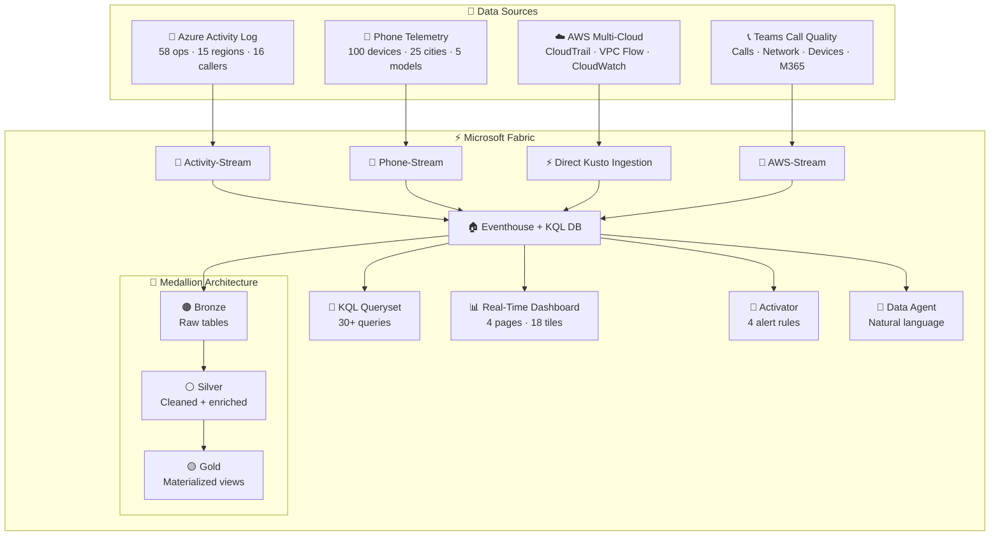

<h1 align="center">
  ⚡ RTI Demo — Real-Time Intelligence on Microsoft Fabric
</h1>

<p align="center">
  <b>Automated deployment of a full Real-Time Intelligence demo using a 9-agent pipeline</b>
</p>

<p align="center">
  
  
  
  
  
  
  
</p>

<p align="center">
  <a href="#-quick-start">Quick Start</a> •
  <a href="#-architecture">Architecture</a> •
  <a href="#-agents">Agents</a> •
  <a href="#-medallion-architecture">Medallion</a> •
  <a href="#-dashboard">Dashboard</a> •
  <a href="#-simulators">Simulators</a> •
  <a href="#-ml-analytics">ML Analytics</a>
</p>

---

## 🎯 What Is This?

A company monitors its **full operations stack** in real-time using **Microsoft Fabric Real-Time Intelligence**. Operations teams get instant visibility into:

- 🔵 **Azure subscription activity** — deployments, failures, policy changes
- 📱 **Phone telemetry** — location, battery, app crashes, signal strength
- ☁️ **AWS multi-cloud security** — CloudTrail, VPC Flow Logs, CloudWatch metrics
- 📞 **Teams call quality** — network probes, device health, M365 service health

All in one unified platform with **AI-assisted investigation** and **automated alerting**.

> [!TIP]
> One command deploys the entire demo: `python deploy.py`

---

## ⚡ Quick Start

```bash
# 1️⃣ Install dependencies
pip install azure-identity requests azure-eventhub

# 2️⃣ Configure
#    Edit config.json with your workspace ID and Azure subscription

# 3️⃣ Deploy everything
python deploy.py

# 4️⃣ Start simulators
python phone_simulator.py      # 100 devices × 25 cities
python activity_simulator.py   # 58 ops × 15 regions
python aws_simulator.py        # 3 AWS tables via direct Kusto ingestion
python teams_simulator.py      # Teams call quality + network probes

# 5️⃣ Validate
python prepare_agents.py --validate   # 28 checks
python prepare_agents.py --status     # Quick health check
```

---

## 🏗️ Architecture



---

## 🤖 Agents

| # | Agent | Module | Role | Key Actions |
|---|-------|--------|------|-------------|
| 🎯 | **@orchestrator** | `deploy.py` | Pipeline coordinator | Reads config, authenticates, invokes agents in order |
| 🏗️ | **@infra** | `agents/infra_agent.py` | Azure IaC | Resource Group + Event Hub Namespace + Diagnostic Settings |
| 🏠 | **@eventhouse** | `agents/eventhouse_agent.py` | Analytics engine | Eventhouse + KQL Database + table schemas |
| 🔄 | **@eventstream** | `agents/eventstream_agent.py` | Data ingestion | 2 Eventstreams (Activity + Phone) |
| 📝 | **@queryset** | `agents/queryset_agent.py` | KQL queries | 30 pre-built queries including ML |
| 📊 | **@dashboard** | `agents/dashboard_agent.py` | Visualization | 4 pages, 18+ tiles, auto-refresh |
| 🚨 | **@activator** | `agents/activator_agent.py` | Alerting | 4 rules: Error Spike, Low Battery, Crash Burst, Device Offline |
| ✅ | **@validator** | `agents/validator_agent.py` | Health check | Verifies items, data flow, connectivity |
| 📱 | **@simulator** | `agents/simulator_agent.py` | Data generation | Phone + Activity simulators |

<details>
<summary><b>🔄 Pipeline Execution Order</b> (click to expand)</summary>

```
1. @infra       → Azure Event Hub + Diagnostic Settings
2. @eventhouse  → Eventhouse + KQL Database + schema
3. @eventstream → 3 Eventstreams (Activity + Phone + AWS)
4. @queryset    → KQL Queryset with 30 demo queries
5. @dashboard   → Real-Time Dashboard (4 pages)
6. @activator   → 4 Activator alert rules
7. @validator   → Post-deployment health check
8. @simulator   → Start phone/activity/AWS/Teams telemetry
```

</details>

---

## 🥇 Medallion Architecture

Inspired by the [GitHub Audit Log Analytics](https://github.com/chakras/github-audit-log-analytics) pattern:

```
  🟤 Bronze (Raw)            ⚪ Silver (Cleaned)          🟡 Gold (Aggregated)
  ┌────────────────┐    ┌───────────────────────┐    ┌──────────────────────────┐
  │ AzureActivity  │──▶ │ silver_AzureActivity  │──▶ │ gold_AzureOpsSummary     │
  │ (raw events)   │    │ (update policy)       │    │ gold_AzureCallerActivity │
  └────────────────┘    └───────────────────────┘    └──────────────────────────┘
  ┌────────────────┐    ┌───────────────────────┐    ┌──────────────────────────┐
  │ PhoneTelemetry │──▶ │ silver_PhoneTelemetry │──▶ │ gold_DeviceHealth        │
  │ (raw events)   │    │ (update policy)       │    │ gold_AppCrashSummary     │
  └────────────────┘    └───────────────────────┘    │ gold_NetworkQuality      │
                                                     └──────────────────────────┘
  ┌────────────────┐    ┌───────────────────────┐    ┌──────────────────────────┐
  │ AWSCloudTrail  │──▶ │ silver_AWSCloudTrail  │──▶ │ gold_AWSSecurityEvents   │
  │ AWSVPCFlowLogs │──▶ │ silver_AWSVPCFlowLogs │    │ gold_AWSAPIActivity      │
  │ AWSCloudWatch  │──▶ │ silver_AWSCloudWatch  │    │ gold_AWSNetworkTraffic   │
  └────────────────┘    └───────────────────────┘    │ gold_AWSInstanceHealth   │
                                                     └──────────────────────────┘
  ┌────────────────┐    ┌───────────────────────┐    ┌──────────────────────────┐
  │TeamsCallQuality│──▶ │ silver_TeamsCallQual   │──▶ │ gold_CallQualityByBldg   │
  │ NetworkProbe   │──▶ │ silver_NetworkProbe    │    │ gold_NetworkHealthSubnet │
  │ DeviceHealth   │──▶ │ silver_DeviceHealth    │    │ gold_DeviceHealthOverview│
  │M365ServiceHlth │    │                       │    │ gold_IssueOriginSummary  │
  └────────────────┘    └───────────────────────┘    └──────────────────────────┘
```

| Layer | Implementation | Purpose |
|-------|---------------|---------|
| 🟤 **Bronze** | Raw tables (9 tables across 4 domains) | Unmodified ingestion |
| ⚪ **Silver** | Update policies + transform functions | Cleaned, typed, enriched |
| 🟡 **Gold** | Materialized views (12+ MVs) | Pre-aggregated for dashboards & alerts |

> [!NOTE]
> Run `medallion-architecture.kql`, `aws-medallion.kql`, and `teams-medallion.kql` after data starts flowing.

---

## 📊 Dashboard

**4 pages · 18 tiles · 30-second auto-refresh**

| Page | Tiles | Highlights |
|------|-------|------------|
| 🔵 **Azure Infrastructure** | Activity timeline, failed ops, caller distribution, error rate KPI | Real-time subscription monitoring |
| 📱 **Phone Fleet Health** | Battery levels, device map, crash report, signal strength, fleet status | 100-device fleet overview |
| 🔗 **Combined Operations** | Ingestion rate, cross-stream analysis | Unified view of both streams |
| 🧠 **ML Analytics** | Anomaly detection, forecasting, auto-clustering, basket analysis | KQL machine learning |

---

## 📱 Simulators

### Phone Telemetry Simulator
| Parameter | Value |
|-----------|-------|
| 📱 Devices | 100 (20 per brand) |
| 🏙️ Cities | 25 worldwide |
| 📲 Brands | Samsung, Apple, Google, OnePlus, Xiaomi |
| 👤 Users | 50 unique |
| ⚡ Rate | ~2,000 events/min |

### Activity Simulator
| Parameter | Value |
|-----------|-------|
| ⚙️ Operations | 58 types |
| 🌍 Regions | 15 Azure regions |
| 👤 Callers | 16 identities |
| 📦 Resource Groups | 15 groups |
| ⚡ Rate | ~750 events/min |

### AWS Multi-Cloud Simulator
| Parameter | Value |
|-----------|-------|
| 📋 Tables | AWSCloudTrail, AWSVPCFlowLogs, AWSCloudWatchMetrics |
| 🏢 Accounts | 3 AWS accounts |
| 🌍 Regions | 6 AWS regions |
| 💻 Instances | 20 EC2 instances |
| 🎭 Anomalies | 4 scenarios (credential stuffing, data exfil, crypto mining, lateral movement) |
| 🔌 Ingestion | Direct Kusto streaming (CSV format) |
| ⚡ Rate | ~90 events/batch every 4s |

### Teams Call Quality Simulator
| Parameter | Value |
|-----------|-------|
| 📋 Tables | TeamsCallQuality, NetworkProbe, DeviceHealth, M365ServiceHealth |
| 🏢 Buildings | 6 (Paris, London, NYC, Seattle, Munich, Singapore) |
| 👤 Users | 75 across all sites |
| 🎭 Anomalies | 8 scenarios (thermal throttle, WiFi contention, ISP degradation, VPN mis-config, DNS cascade, driver regression, meeting storm, asymmetric) |
| 🔌 Ingestion | Eventstream Custom Endpoint (JSON) |
| ⚡ Rate | ~100 events every 3s |

---

## 🧠 ML Analytics

The KQL Queryset includes advanced machine learning queries:

| ML Capability | KQL Function | Use Case |
|---------------|-------------|----------|
| 🔍 **Anomaly Detection** | `series_decompose_anomalies()` | Detect unusual spikes in operations or telemetry |
| 📈 **Forecasting** | `series_decompose_forecast()` | Predict future trends in battery/signal |
| 🎯 **Auto-Clustering** | `autocluster()` | Find common patterns in failures |
| 🧺 **Basket Analysis** | `basket()` | Discover co-occurring event patterns |
| ↔️ **Diff Patterns** | `diffpatterns()` | Compare error vs success patterns |

---

## 🚨 Activator Alert Rules

| Rule | Condition | Action |
|------|-----------|--------|
| 🔴 **Error Spike** | >5 errors in 10-min window | Teams notification |
| 🔋 **Low Battery** | Battery < 15% on any device | Email to device owner |
| 💥 **Crash Burst** | >3 crashes per app in 5 min | Trigger incident pipeline |
| 📴 **Device Offline** | No heartbeat for 5 min | Teams notification |

---

## 🔧 Configuration

All settings in `config.json`:

```json
{
  "azure": { "subscription_id": "...", "resource_group": "..." },
  "fabric": { "workspace_id": "..." },
  "event_hub": { "namespace": "...", "connection_string": "..." },
  "items": {
    "eventhouse": { "display_name": "RTI-Demo-Eventhouse" },
    "eventstream_activity": { "display_name": "Activity-Stream" },
    "eventstream_phone": { "display_name": "Phone-Stream" },
    "queryset": { "display_name": "RTI-Demo-Queries" },
    "dashboard": { "display_name": "Operations-Dashboard" },
    "activator": { "display_name": "Demo-Alerts" }
  }
}
```

---

## 🔐 Authentication

Uses `azure.identity` for token acquisition:

| Scope | URL |
|-------|-----|
| 🟣 Fabric API | `https://api.fabric.microsoft.com/.default` |
| 🔵 Azure Management | `https://management.azure.com/.default` |
| 🟢 Kusto Queries | `{cluster_uri}/.default` |

---

## 📁 Project Structure

```
RTIDemo/
├── 🎯 deploy.py                    # Orchestrator — runs all agents
├── 📱 phone_simulator.py           # 100-device telemetry simulator
├── ⚙️ activity_simulator.py        # Azure activity simulator
├── ☁️ aws_simulator.py             # AWS multi-cloud simulator (CSV, direct Kusto)
├── 📞 teams_simulator.py           # Teams call quality simulator (JSON, Eventstream)
├── ✅ prepare_agents.py             # Validation tool (28 checks)
├── 📋 config.json                  # All settings & item IDs
├── 📊 RealTimeDashboard_fixed.json # Dashboard definition (4 pages)
│
├── 🥇 medallion-architecture.kql   # Silver + Gold for Azure Activity + Phone
├── 🥇 aws-medallion.kql            # Silver + Gold for AWS (security analytics)
├── 🥇 teams-medallion.kql          # Silver + Gold for Teams (call quality)
├── 📝 demo-queries.kql             # 30 KQL queries (incl. ML)
├── 📝 aws-queries.kql              # AWS security analytics queries
├── 📝 teams-queries.kql            # Teams call quality queries
├── 📝 aws-schema.kql               # AWS bronze table schemas
├── 📝 teams-schema.kql             # Teams bronze table schemas
├── 📝 teams-ontology.kql           # Teams cross-layer ontology
│
├── 🌐 phone-telemetry.html         # Real device telemetry web page
├── 🏗️ setup-azure.ps1              # Azure resource setup script
│
├── agents/                          # 🤖 Agent modules
│   ├── fabric_client.py             # Fabric REST API client
│   ├── infra_agent.py               # Azure infrastructure
│   ├── eventhouse_agent.py          # Eventhouse + KQL DB
│   ├── eventstream_agent.py         # Eventstream pipelines
│   ├── queryset_agent.py            # KQL Queryset
│   ├── dashboard_agent.py           # Real-Time Dashboard
│   ├── activator_agent.py           # Activator alert rules
│   ├── validator_agent.py           # Post-deploy health check
│   └── simulator_agent.py           # Simulator management
│
├── 📖 README.md                     # This file
├── 📖 AGENTS.md                     # Multi-agent architecture docs
├── 📖 RTI-Demo-Plan.md             # Detailed demo plan
└── 📖 ACTIVATOR_SETUP.md           # Activator manual setup guide
```

---

## 📦 Dependencies

```bash
pip install azure-identity requests azure-eventhub
```

---

## 📚 References

- [Microsoft Fabric Real-Time Intelligence](https://learn.microsoft.com/en-us/fabric/real-time-intelligence/)
- [KQL Reference](https://learn.microsoft.com/en-us/kusto/query/)
- [Fabric REST API](https://learn.microsoft.com/en-us/rest/api/fabric/)
- [Fabric Data Agent](https://learn.microsoft.com/en-us/fabric/data-science/concept-data-agent)
- [GitHub Audit Log Analytics (Medallion Pattern)](https://github.com/chakras/github-audit-log-analytics)

---

<p align="center">
  Built with ❤️ using <b>Microsoft Fabric Real-Time Intelligence</b>
</p>
